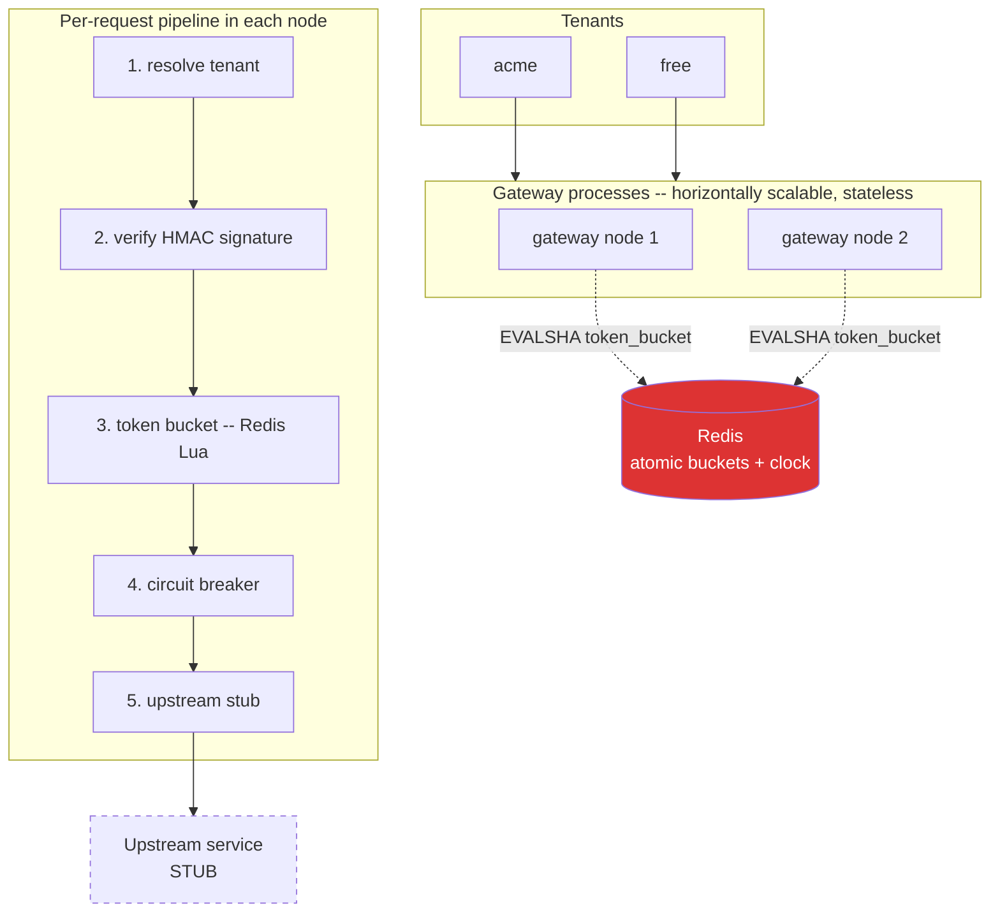

# Distributed Rate-Limited API Gateway

A per-tenant, distributed **token-bucket rate limiter** that stays correct under
concurrency across any number of processes — plus the gateway machinery around
it: HMAC request signing, per-tenant circuit breakers, and graceful degradation.

Built in one day as a **vertical slice**, not a product. The point is one hard
thing done correctly and *proven*, not breadth. Node + TypeScript, Redis, Vitest.

```bash
# 1. Redis must be running locally (redis-server)
npm install
npm test          # 16 tests incl. the concurrency proof
npm run demo      # side-by-side: atomic path holds, naive path races
npm run bench     # p50/p95/p99 latency + throughput
```

---

## The hard problem

A token bucket in a single process is trivial:

```ts
if (tokens > 0) { tokens--; allow() } else { deny() }
```

The difficulty is that **`read tokens → decide → write tokens` is three
operations, not one.** Under concurrency two requests can both read `tokens = 1`,
both decide "allow", and both write `tokens = 0` — admitting **two** requests
against a budget of **one**. This is a classic *check-then-act* race.

Distributing it makes it worse: the bucket state is shared by many gateway
processes, so an in-memory mutex is useless — there's nothing in *any single
process* to lock. The atomicity has to live where the state lives: in Redis.

Getting this exactly right — never over-admitting, never under-admitting, no
matter how requests interleave or how many nodes are involved — is the whole
game. Everything else in this repo is the supporting cast.

## My approach: one atomic Lua script

The entire `refill → check → consume` sequence runs as a single **Lua script
inside Redis** ([`src/lua/token_bucket.lua`](src/lua/token_bucket.lua)):

- **Redis is single-threaded and runs a script to completion before servicing
  any other command.** So the read-modify-write is *indivisible*. No interleaving
  is possible — the race cannot occur. That is the mechanism.
- **Lazy refill.** Instead of a background job topping up every bucket on a
  timer, the script computes how many tokens *would* have accrued since the key
  was last touched: `tokens = min(capacity, tokens + elapsed × refillRate)`.
  O(1) per request, no cron, and idle tenants cost nothing.
- **Redis `TIME` is the clock**, not the caller's clock. Every gateway node
  shares one clock source, so a node with a fast wall-clock can't trick its
  bucket into refilling early. Immune to client clock skew.
- **Per-tenant quotas fall out for free** — the bucket is just keyed by tenant
  (`rl:<tenantId>`), each with its own capacity/refill. One mechanism, two of the
  five requirements.
- **Bounded memory** — buckets carry a TTL sized to their full-refill time, so
  idle tenants evaporate from Redis.

The TypeScript side ([`src/rateLimiter.ts`](src/rateLimiter.ts)) is a thin typed
façade: it registers the script once (ioredis then calls it via `EVALSHA`, with
automatic `EVAL` fallback on `NOSCRIPT`) and maps tenant IDs to quotas. **All
correctness lives in the Lua.**

## The approach I rejected, and why

**`WATCH` / `MULTI` / `EXEC` (optimistic locking).** You `WATCH` the bucket key,
read it, compute the new value in JavaScript, then `MULTI`/`EXEC`; if another
client touched the key in between, `EXEC` aborts and you retry.

It works, and it keeps the logic in TypeScript (easier to unit-test in
isolation). I rejected it because:

- **Multiple round-trips per decision** (WATCH, GET, MULTI, EXEC) vs a single
  `EVALSHA`. Latency and load both rise.
- **Retry storms under contention.** A *hot* tenant — exactly the one you most
  need to rate-limit — is where many requests hit the same key at once. That's
  where optimistic retries thrash: each aborted `EXEC` re-reads and retries,
  wasting round-trips precisely under the load you care about. Risk of livelock.
- The Lua approach turns "hope nobody else wrote" into "nobody else *can* write
  mid-decision." It's the stronger guarantee for less work.

The one honest cost of Lua: a long script blocks the whole Redis instance
(single-threaded). Ours is O(1) and tiny, so that's a non-issue here — but it's
why you never put heavy loops in a Redis script.

## Proof the mechanism is real

Correctness claims are cheap; this one is tested. [`test/concurrency.test.ts`](test/concurrency.test.ts)
fires **500 requests concurrently** (all in flight before any resolves) at a
frozen bucket of capacity **100**, and asserts **exactly 100** are admitted —
over 20 rounds. Not "about 100." Exactly.

Then the control group: [`NaiveRateLimiter`](src/rateLimiterNaive.ts) implements
the *identical* token-bucket math but as separate `HMGET` → compute → `HSET`
round-trips from Node — reopening the race. `npm run demo` runs the same
assertion through both:

```
Firing 500 CONCURRENT requests at a frozen bucket of capacity 100
Correct behaviour: EXACTLY 100 allowed, 400 denied.
────────────────────────────────────────────────────────────────
round 1  atomic(Lua): 100 → PASS   naive(JS): 500 → FAIL  (over by 400)
...
✅ ATOMIC path held the quota exactly, every round.
❌ NAIVE path over-admitted — the check-then-act race is real, and the
   Lua atomicity is the only thing preventing it.
```

The naive path admits *all 500* because every concurrent request reads the same
cold bucket **before** any write lands — the check-then-act race in its purest
form. Remove the atomic script, the race returns. That's the evidence the
atomicity is load-bearing, not decoration.

## Benchmark

`npm run bench` — 20,000 requests, concurrency 50, single Node process against
local Redis over loopback:

| Metric | Value |
| --- | --- |
| Throughput | **~47,000 req/s** |
| Latency p50 | 0.91 ms |
| Latency p95 | 1.8 ms |
| Latency p99 | **~2.5 ms** |
| Latency max | 3.6 ms |

Representative single run (varies ~±15% run to run). That's the overhead the
limiter adds to each request. Numbers are from one Node process + loopback Redis;
a real deployment adds network latency to Redis but scales horizontally — the
limiter is stateless, so all coordination state lives in Redis.

## Architecture



The key insight the diagram encodes: **many stateless gateway nodes, one shared
Redis holding both the bucket state and the clock.** Atomicity in that shared
store is what makes the distributed limit a single global limit rather than N
independent local ones.

Request pipeline ([`src/gateway.ts`](src/gateway.ts)), in order:

1. **Resolve tenant** — unknown → `401`.
2. **Verify HMAC signature** ([`src/signing.ts`](src/signing.ts)) — binds each
   request to a per-tenant secret so a caller can't forge `x-tenant-id` to spend
   another tenant's quota. Timing-safe compare; timestamp freshness window blocks
   replays. Bad/missing/stale → `401`.
3. **Rate limit** — the atomic bucket. Over quota → `429` with a retry hint.
4. **Circuit breaker** ([`src/circuitBreaker.ts`](src/circuitBreaker.ts)) — per
   tenant; after N upstream failures it opens and short-circuits (`503`) for a
   cooldown, then trials **exactly one** request (half-open, single-flight)
   before closing — concurrent requests during the trial are short-circuited so
   a recovering upstream isn't stampeded.
5. **Upstream** — a stub.

Throttled/denied responses carry a `retry-after-ms` hint; a value of **`-1`**
means "never retryable as-is" (the request is larger than the bucket, or the
bucket is frozen and will never refill) so a well-behaved client gives up
instead of hot-looping.

**Graceful degradation:** if Redis is unreachable, the limiter can't make a
decision. Policy is explicit and configurable (`DEGRADATION` env):

- `fail_open` (default) — allow the request, flag it `x-degraded: true`. A rate
  limiter that takes the whole API down when its *bookkeeping store* hiccups has
  inverted its own purpose.
- `fail_closed` — refuse with `503`. Favours protection over availability.

This is a genuine tradeoff, not an oversight — it's a per-deployment call. (One
sharp edge, called out below: the degradation branch currently treats *any*
limiter error as "Redis is down," so a bug in the limiter itself would be masked
as a degradation rather than surfaced.)

## Running the HTTP demo

```bash
npm start                      # gateway on :8080
# in another shell:
npm run demo:http              # signed/unsigned/forged/quota, end to end
npm run sign acme /api/hello   # prints a ready-to-run signed curl
```

## What's stubbed / not production-ready

This is a one-day slice. The atomic limiter is the real, tested part; the rest is
scaffolding sized to demonstrate it. Deliberate cuts:

- **Tenants & quotas are hardcoded** ([`src/tenants.ts`](src/tenants.ts)). Real
  config comes from a control-plane DB/service with hot reload. No tenant
  onboarding, no auth beyond signing.
- **Signing secrets are hardcoded in source.** Real secrets live in a KMS/secret
  store and rotate. Never ship the values in this repo.
- **Replay protection is a time window, not a nonce.** A captured request can be
  replayed *within* the freshness window. Real replay defence needs a
  server-side nonce/jti store (itself in Redis). Called out because it's a real
  limitation, not a bug.
- **The upstream is an in-process stub** ([`src/upstream.ts`](src/upstream.ts))
  with a health toggle so the circuit breaker has something to trip on. No real
  proxying, retries, or load balancing.
- **Circuit-breaker state is per-process.** Each node protects its own connection
  pool independently; there's no shared breaker view. Acceptable, but not the
  same as a cluster-wide breaker.
- **Single Redis node.** No Sentinel/Cluster, no failover story. Redis is a
  single point of failure — the degradation policy is the only mitigation here.
- **Degradation catch is broad.** The rate-limiter error handler treats every
  exception as "Redis unreachable" and applies the degradation policy. It can't
  distinguish a connection drop from a Lua/script error or a genuine bug — a
  real limiter fault would be silently masked as degradation. A production build
  would classify the error and only degrade on connectivity failures.
- **No auth/registration/UI/admin/email/uploads** — explicitly out of scope.
- **`npm audit` flags dev-toolchain advisories** (transitive deps of the test
  runner), not runtime dependencies. The one runtime dep is `ioredis`.

### On the tests

The concurrency proof uses a *frozen* bucket (`refillRate=0`) on purpose: it
removes time/refill from the equation so the assertion can be **exact** (`=== 100`)
rather than a fuzzy range. Refilling behavior is covered separately by the
free-tier gateway test and the free-tier smoke path. The naive control group is
asserted to be correct *sequentially* (same math as the atomic path) so the
over-admission it shows under load is provably the race, not a different formula.

### Correctness review

Before shipping, the hard-problem code was put through an adversarial review
(multiple independent readers across atomicity, pipeline, signing, and test
integrity, each finding then re-checked by a skeptic). It surfaced 12 real
issues; the load-bearing ones were fixed and are covered by tests — a frozen
bucket resetting to full after TTL expiry (over-admission in the core), the
circuit breaker admitting the whole herd in half-open, an ambiguous signing
canonicalization allowing signature reuse, and process-crash / body-DoS holes in
the http surface. The remainder (listed above) are deliberate slice-scope
limitations, not unknowns.

## Layout

```
src/
  lua/token_bucket.lua   the atomic core — refill+check+consume in one script
  rateLimiter.ts         typed façade over the Lua script
  rateLimiterNaive.ts    deliberately-racy control group (for the proof)
  tenants.ts             hardcoded tenant quotas + secrets (stub)
  signing.ts             HMAC request signing + replay window
  circuitBreaker.ts      closed/open/half-open state machine
  upstream.ts            stub upstream with a failure toggle
  gateway.ts             the request pipeline
  server.ts              bare node http surface
test/                    concurrency proof + unit/integration tests
demo/                    mechanism.ts (the proof) + http_demo.ts
bench/loadtest.ts        latency/throughput benchmark
tools/sign.ts            generate a signed curl
```
